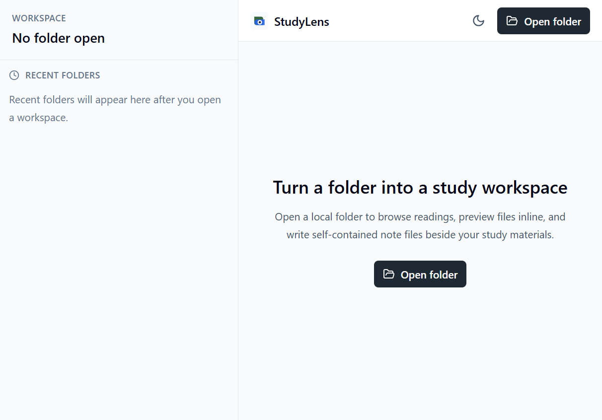
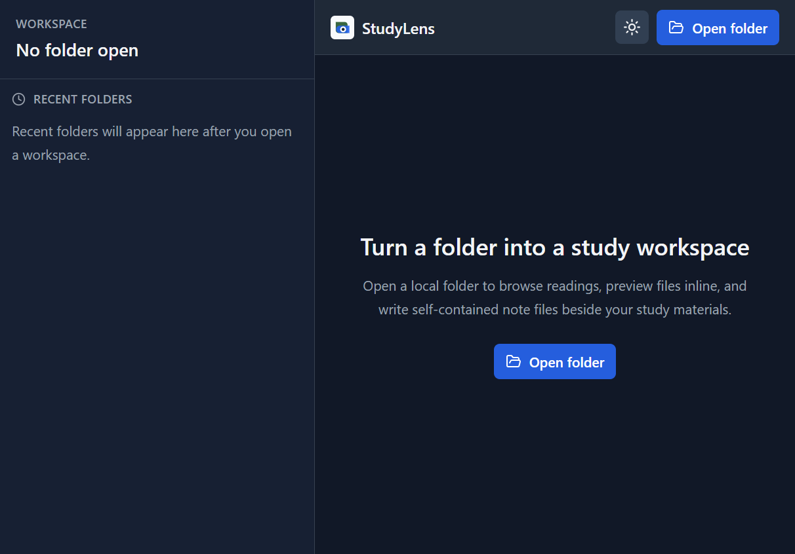

# StudyLens

StudyLens is a local-first study workspace for keeping course materials and notes together. Open a folder from your computer, browse and preview its files, and write rich notes that are saved back into that folder. It is designed to reduce the friction of switching between reading material, note-taking apps, and cloud services while keeping your study folder as the source of truth.

There is no StudyLens account or application backend. Folder access is granted by the browser, and notes are regular HTML files that can also be opened outside the app. Recent-folder references are stored locally in the browser.

## Screenshots

| Empty workspace (light) | Empty workspace (dark) |
| --- | --- |
|  |  |

## What It Does

- Opens a local folder as a workspace in desktop Chrome or Edge.
- Browses files and folders in a searchable, filterable tree.
- Previews PDFs, images, text, audio, and video when the browser can display the format.
- Edits one or more rich-text HTML notes stored alongside the study materials, with debounced saving.
- Clips selected text from a text preview into a note.
- Adds headings-based note navigation, pasted images, and embedded Excalidraw whiteboards.
- Remembers recently opened folders in the browser and supports light and dark themes.
- Offers a temporary, read-only drag-and-drop preview in browsers without folder access support.

## Setup

Requirements: Node.js and npm. For full folder access, use a current desktop version of Chrome or Edge.

```bash
git clone <repository-url>
cd <repository-directory>
npm install
npm run dev
```

Open the local URL printed by Vite, usually `http://localhost:5173`. Select **Open folder** and grant read/write access to the folder you want to use. StudyLens creates its default `note.html` there when you save your first note.

Available commands:

| Command | Purpose |
| --- | --- |
| `npm run dev` | Start the local Vite development server. |
| `npm run build` | Type-check and build the production app. |
| `npm run preview` | Serve the production build locally. |
| `npm run lint` | Run ESLint. |

## Browser Support

Full workspaces depend on the browser File System Access API, including permission to read and write the selected folder. This is supported in Chromium-based desktop browsers such as Chrome and Edge. In browsers without this API, files can be dropped in for temporary read-only previews; persistent folder workspaces and note saving are unavailable. Browser storage can retain folder handles, but permissions may need to be granted again later.

## Architecture

StudyLens is a client-side React and TypeScript application built with Vite and Tailwind CSS. Its main data flow is:

```text
AppShell
	├─ useDirectoryAccess ── browser folder picker and permission checks
	├─ useFileTree ───────── recursive folder scan and file metadata
	├─ useFilePreview ────── selected file to browser preview data
	└─ useNotesManager ───── note discovery, editing, sanitization, and saving
				├─ IndexedDB ───── recent folder handles and timestamps
				└─ local folder ── self-contained HTML note files
```

- `src/app/` composes the workspace shell and application entry points.
- `src/components/` contains the file tree, previews, editor, toolbars, and layout components.
- `src/hooks/` coordinates folder access, file scanning, previews, note state, debounced saves, and recent folders.
- `src/services/` owns browser file operations, scanning, note discovery and HTML handling, permissions, preview URLs, and IndexedDB access.
- `src/types/` and `src/utils/` hold shared domain types and small helpers.

The selected directory is the durable source of truth. `useFileTree` calls the recursive scanner to build the navigable tree; file previews use browser-native viewers or text/media elements. The note manager reads and writes note files through File System Access API handles, sanitizes note HTML with DOMPurify, and refreshes the file tree after saves. `idb` stores recent folder handles as browser-local metadata, not as a copy of the folder contents.

## Technology

React, TypeScript, Vite, and Tailwind CSS form the application foundation. Tiptap/ProseMirror powers rich-text notes, Excalidraw provides embedded whiteboards, DOMPurify sanitizes note HTML, `idb` wraps IndexedDB, and Lucide supplies interface icons.
